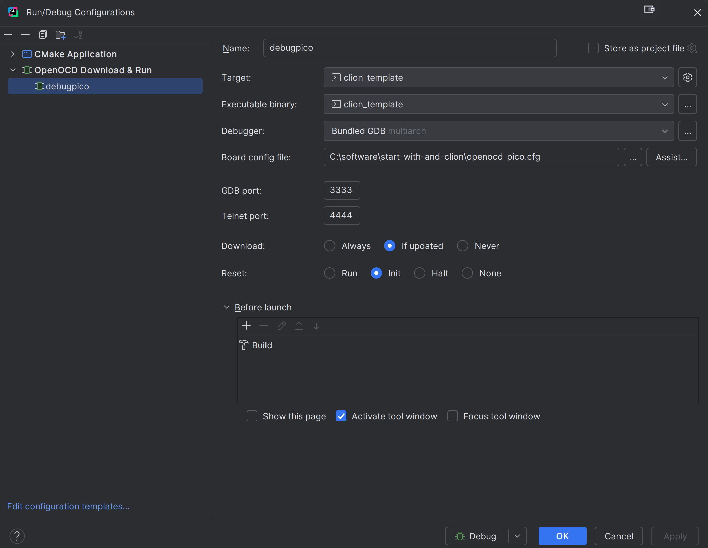

## Proiect de start in CLION cu RP2040

Pentru alte configurări, sisteme de operare, ide... acest pdf:

https://datasheets.raspberrypi.com/pico/getting-started-with-pico.pdf

Deschide acest proiect folosind CLion. Adaugă un PICO_SDK_PATH=<cale-către-sdk> la profilul tău cmake:
   

Proiectul tău CLion este acum gata de utilizare. Poți construi proiectul și încărca fișierul generat. 
Dacă ai urmat ghidul picoprobe, poți începe depanarea, dar mai întâi trebuie să creezi un fișier de 
configurare openocd.

Pluginul OpenOCD acceptă doar un singur fișier. Asta înseamnă că nu putem adăuga fișiere
separate pentru placă și interfață, așa cum vezi în documentația pentru pico. Soluția este să creezi 
un fișier personalizat și să incluzi toate fișierele necesare. Fișierul openocd_pico.cfg 
servește drept configurare.

**fisierul svd.** 
Poți utiliza acest fișier pentru a vedea valoarea curentă a registrelor:

Pentru a obține consola serială, trebuie mai întâi să instalezi pluginul „Serial Monitor” 
și apoi să creezi o nouă conexiune:

